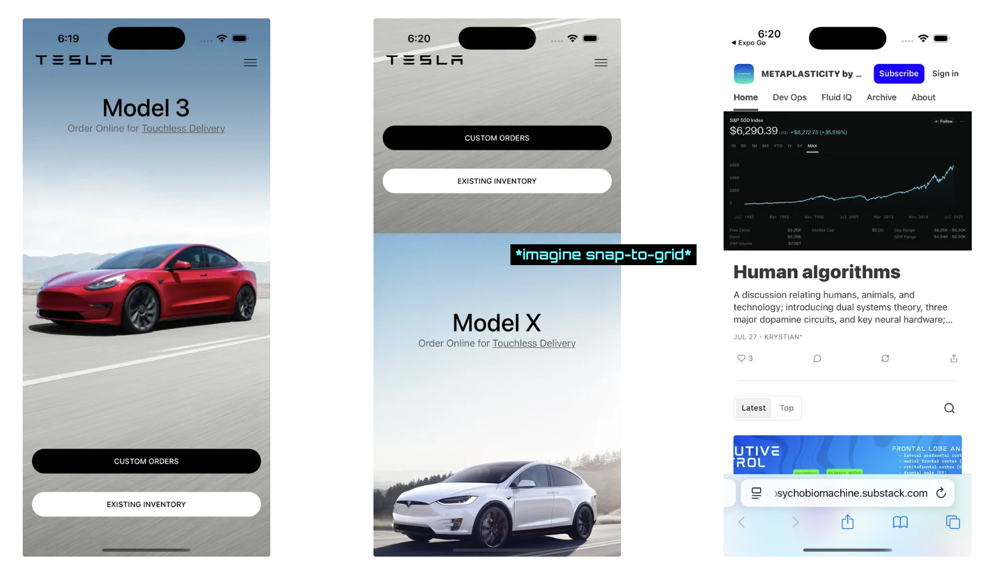

This is an ideal first React Native project. It's taught by Vadim at notJust.dev (https://www.youtube.com/watch?v=iQ_0Fd_N3Mk&ab_channel=notJust%E2%80%A4dev)


Tutorial Includes:
* You learn to initiate a project via expo router, create and style components, nest and integrate components into an app in ~ 2hours.
* Finished app includes: A scrollable feed of car listings composed of listing components, button components, and a header component. Scroll behavior is also made snap-to-grid like a tiktok feed.
* Vadim starts off by hardcoding the components and then shows you how to transform them into reusable components by implementing props. I appreciated this.
* This app makes for a great reference for other projects that implement feed scrolling, buttons, headers, links.
* I directed all of the pressable items to my Cognitive Neuroscience blog: METAPLASTICITY by PSYCHOBIOMACHINE (https://psychobiomachine.substack.com/)

Note: 
* This youtube video is like 4 years old and Vadim uses '.js' for all of his files and keeps his main 'App.js' file out in the open. I had to make a couple of changes to make it work. However, it's still a React Native app and it's written using JSX + js. 
* It's still very easy to follow along.
* As of 8-2025 expo projects default to typescript (.tsx) and the 'App.js' file that Vadim worked on is in the 'App' directory as 'index.tsx'. It doesn't make a big difference. You don't have to implement typescript 'typing' in .tsx files. There is no implementation of typescript features in this app and I only created .jsx files during this project. I left all of the .tsx configuration materials alone.
* You will need to adjust the all of the paths (ex: ../assets -> ../../assets ) due to the index file being in its own directory.
* The console.warn() statements and error messages appear in the terminal and not in the browser which is I guess how expo did things 4 years ago. 
* You will still need to download XCODE from the MacOS app store to get the iOS simulator




[Below is the basic expo start up README]

# Welcome to your Expo app 👋

This is an [Expo](https://expo.dev) project created with [`create-expo-app`](https://www.npmjs.com/package/create-expo-app).

## Get started

1. Install dependencies

   ```bash
   npm install
   ```

2. Start the app

   ```bash
   npx expo start
   ```

In the output, you'll find options to open the app in a

- [development build](https://docs.expo.dev/develop/development-builds/introduction/)
- [Android emulator](https://docs.expo.dev/workflow/android-studio-emulator/)
- [iOS simulator](https://docs.expo.dev/workflow/ios-simulator/)
- [Expo Go](https://expo.dev/go), a limited sandbox for trying out app development with Expo

You can start developing by editing the files inside the **app** directory. This project uses [file-based routing](https://docs.expo.dev/router/introduction).

## Get a fresh project

When you're ready, run:

```bash
npm run reset-project
```

This command will move the starter code to the **app-example** directory and create a blank **app** directory where you can start developing.

## Learn more

To learn more about developing your project with Expo, look at the following resources:

- [Expo documentation](https://docs.expo.dev/): Learn fundamentals, or go into advanced topics with our [guides](https://docs.expo.dev/guides).
- [Learn Expo tutorial](https://docs.expo.dev/tutorial/introduction/): Follow a step-by-step tutorial where you'll create a project that runs on Android, iOS, and the web.

## Join the community

Join our community of developers creating universal apps.

- [Expo on GitHub](https://github.com/expo/expo): View our open source platform and contribute.
- [Discord community](https://chat.expo.dev): Chat with Expo users and ask questions.
